# World Cup Story
A simple static website built with HTML &amp; CSS that tells the story of the FIFA Men’s World Cup. It highlights tournaments, winners, and historic moments in football history.

**Visit World Cup Story 👇**
 
<a href="https://tal-81.github.io/World-Cup-Story/" target="_blank">Click here to visit 🏆 <strong> World Cup Story <strong> Website</a>

## 📑 Table of Contents
- [Project Overview](#project-overview)
- [Responsive Design](#responsive-design)
- [Script Languages Used](#script-languages-used)
- [Technologies Used](#technologies-used)
- [Sources](#sources-of-images-fonts-and-information)
- [Screenshots](#screenshots)
- [Design(Wireframes)](#designwireframes)
- [Testing](#testing)
- [Unfixed bugs](#unfixed-bugs)
- [Deployment](#deployment)

  

## Project Overview

This website provides an interactive timeline of the World Cup, starting from the first tournament in 1930 up to the latest editions. It includes information about host countries, champions, and key moments that shaped the tournament’s history.

## Responsive Design
*  It has a responsive design that works with most devices.

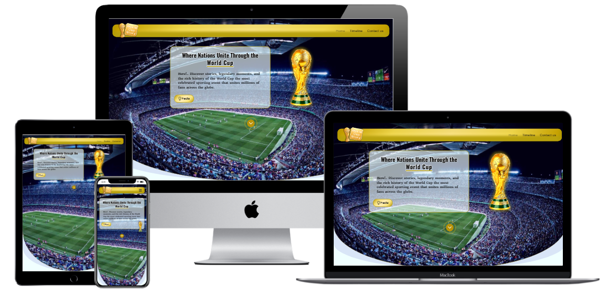

## Script Languages Used

* HTML
* CSS

## Technologies Used

*  Adobe Photoshop (Edit raster images).
*  Adobe Illustrator (Design a logo as a vector Image).
*  Formsubmit.co (Connect my form to this form endpoint service).
*  Chatgpt (to support and answer on my questions).
*  Git & Github (save my project files and deploy my project on GitHub Pages).

## Sources of images, fonts and information

*  Images from Adobe Stock.
*  Fonts and icons from Google Fonts.
*  Information from Chatgpt.

## Screenshots

*       World Cup Story Website has Three Pages.
1.  _Home Page (Hero Section, Gallery, Facts)_:
 
       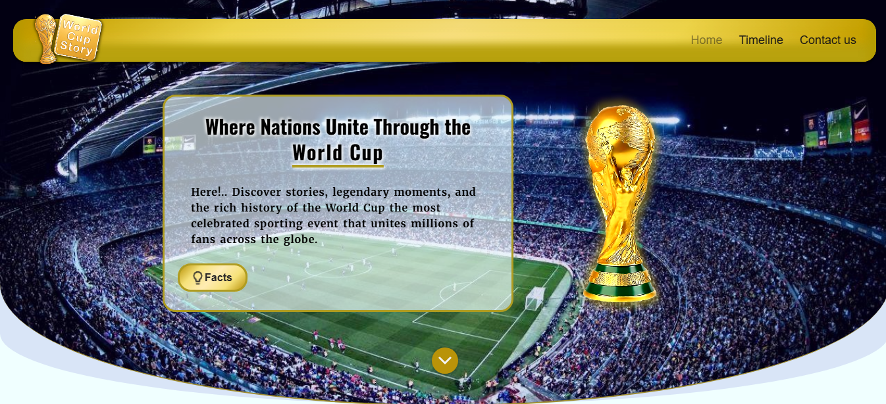
       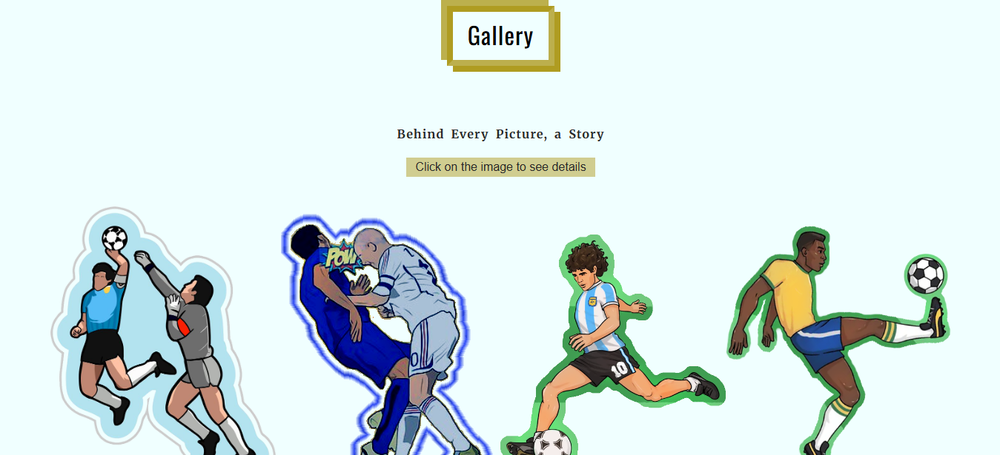
       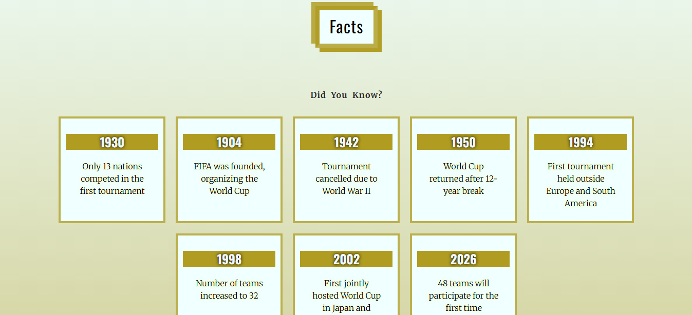
      

2. *Timeline (Hero Section, Tournaments)*:
 
    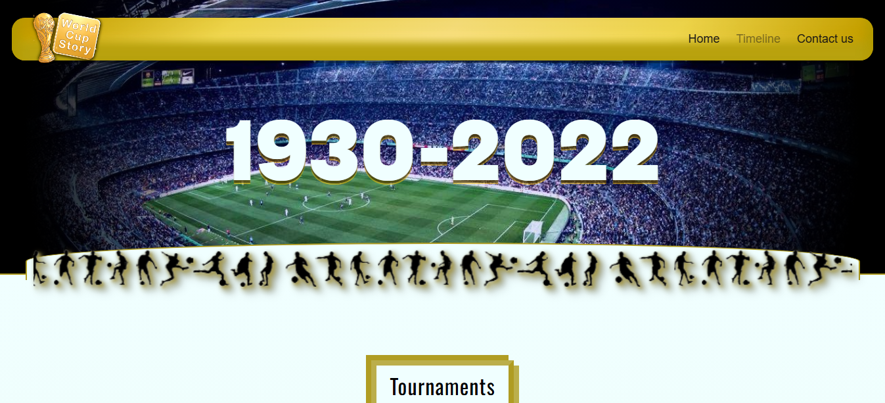
    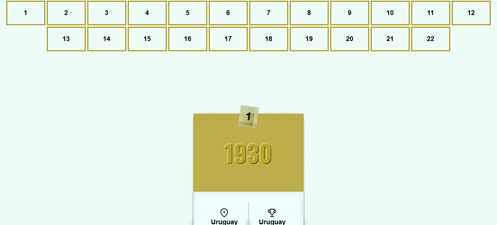
 
  
3.  *Contact Us (Hero Section, Form)*:
 
    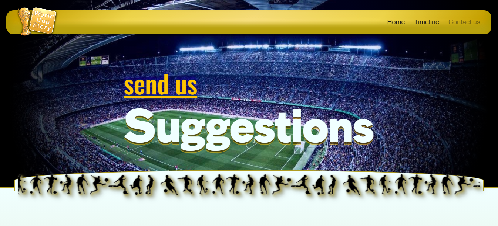
    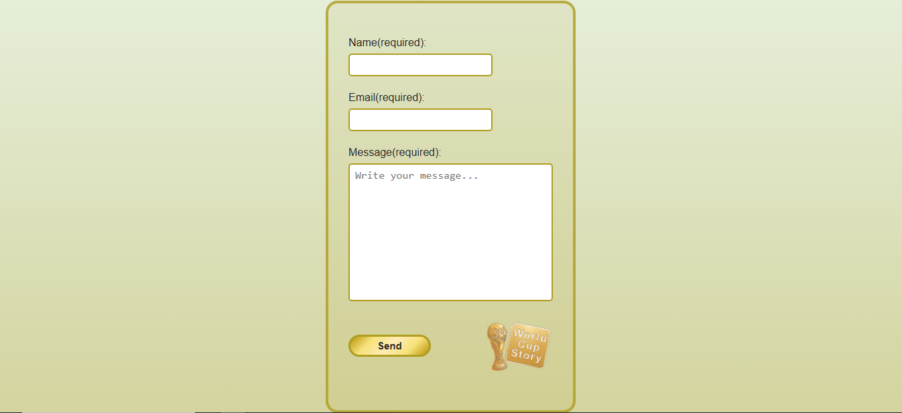
 
  
## Design(Wireframes)
*   **<u>Desktop Design:</u>**
1.  _Home Page_:
 
        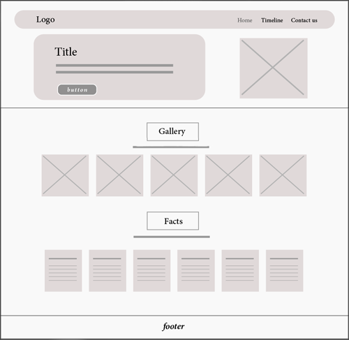
 
2.  _Timeline Page_:
 
        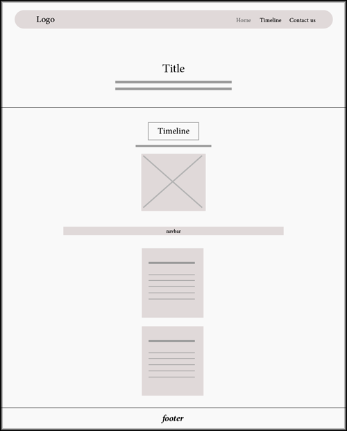
 
3.  _Contact Page_:
 
        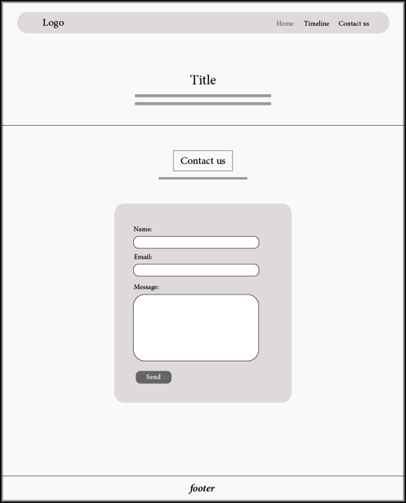
 

*   **<u>Mobile Design:</u>**
1.  _Home Page_:
 
        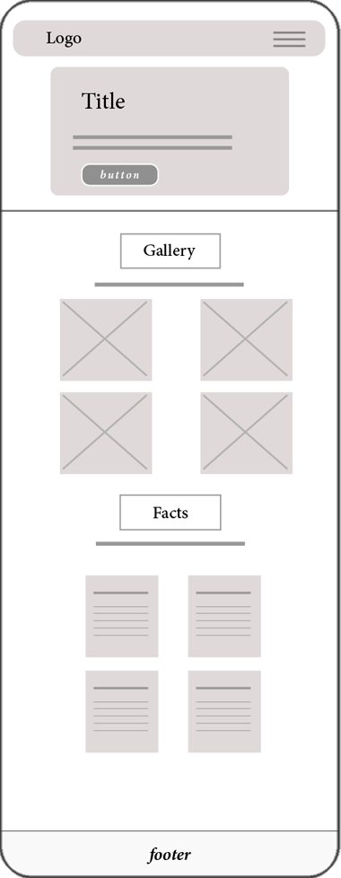
 
2.  _Timeline Page_:
 
        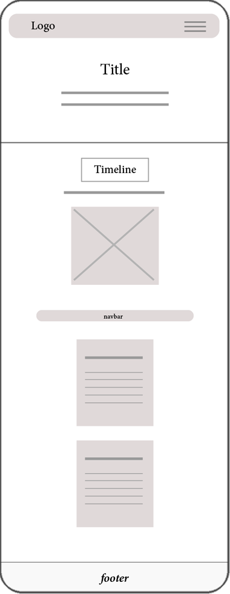
 
3.  _Contact Page_:
 
        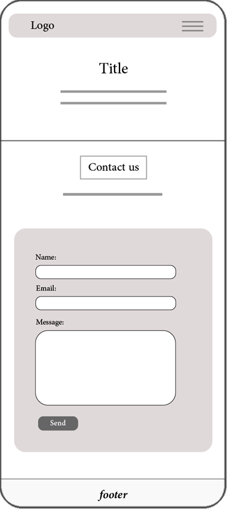
 

        
## Testing
*       By(W3C CSS Validator/ W3C HTML Validator)

My website has been tested and includes a responsive design, a readable navbar, and a working form with enhanced UI and UX.

*   **<u>Test HTML files:</u>**
1.  _index.html_:
 
        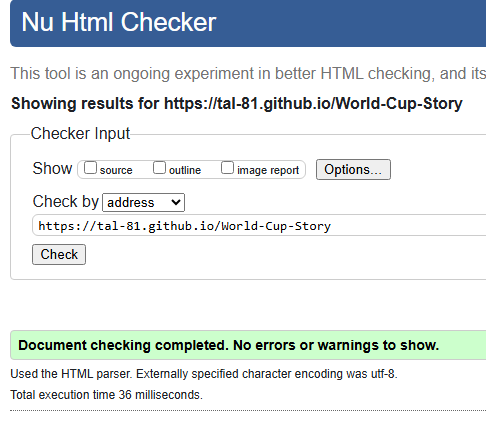
 
2.  _timeline.html_:
 
        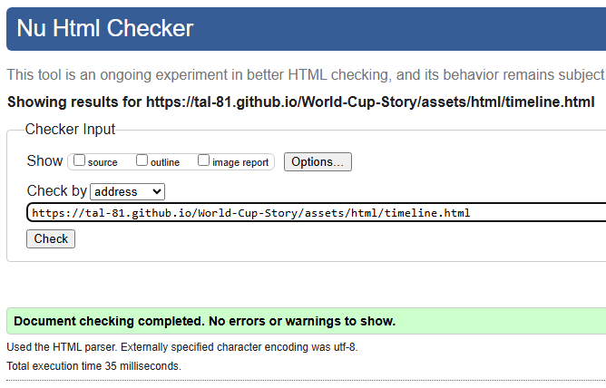
 
3.  _contactus.html_:
 
        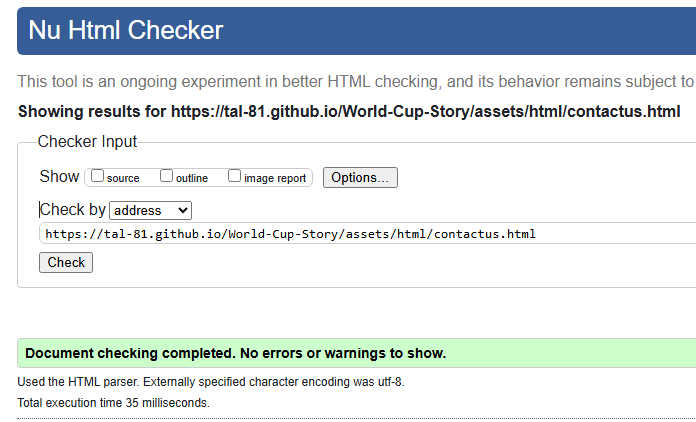
  

*   **<u>Test CSS files:</u>**
1.  _style.css_:
 
        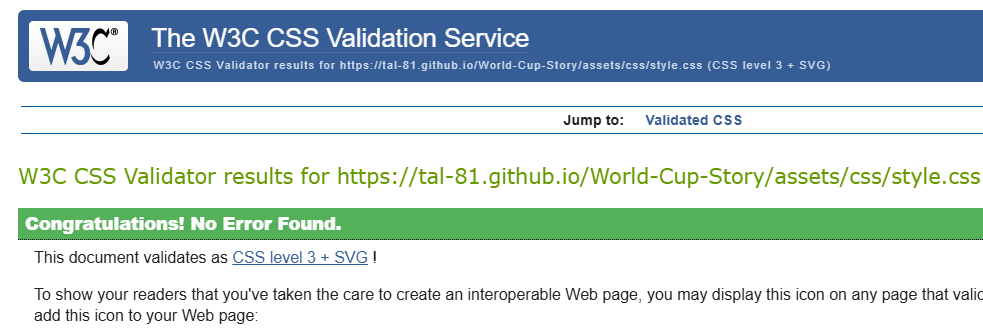
 
2.  _index.css_:
 
        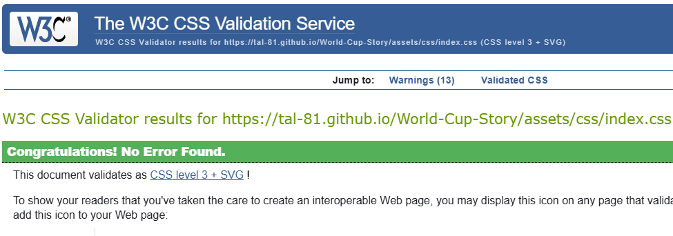
 
3.  _timeline.css_:
 
        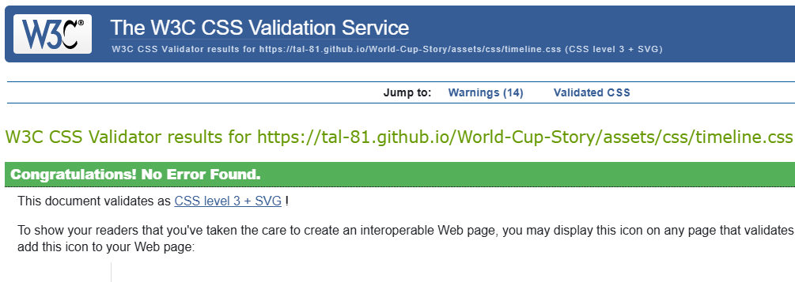
 
4.  _contactus.css_:
 
        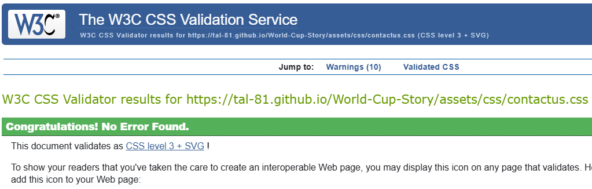
 

*   **<u>Test Website by Lighthouse Tool from Google Chrome:</u>**
1.  _Performance, SEO, Accessibility and Prctice_:
  
        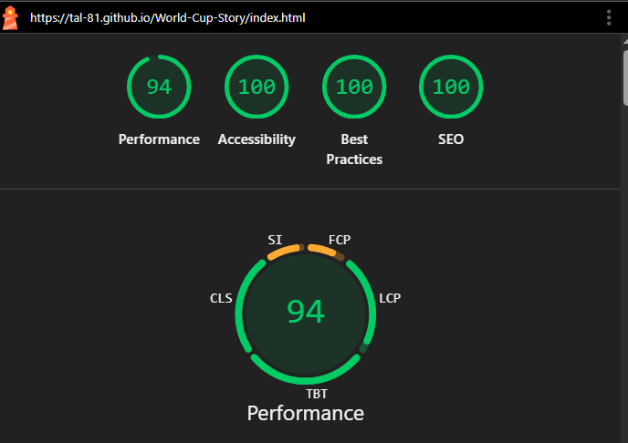
 

## Unfixed bugs
* None

## Deployment
*       The project is being deployed on GitHub Pages.
 
* <a href="https://tal-81.github.io/World-Cup-Story/" target="_blank">Click here to visit 🏆 <strong> World Cup Story <strong> Website</a>
  

[Back Top](#world-cup-story)
